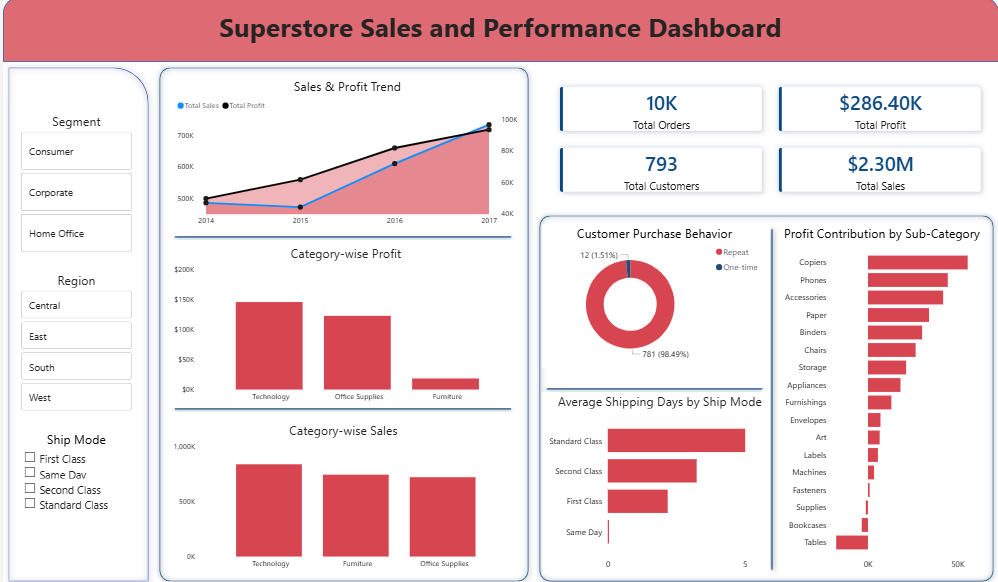

# Superstore Sales Analysis

**Tools:** Python · SQL (PostgreSQL) · Power BI  
**Dataset:** 9,000+ sales transactions across product categories, regions, and customer segments  
**GitHub:** [View Repository](https://github.com/bhavika-chouhan/superstore-sales-analysis)

---

## Business Problem

A retail superstore needed to understand why overall profit margins were underperforming despite strong sales numbers. The goal was to identify which products, regions, and discount practices were silently draining profitability — and which were driving it.

---

## What I Found

### 3 Sub-Categories With Negative Profit Margins
Despite generating sales revenue, these sub-categories were losing money on every order:

| Sub-Category | Profit Margin |
|---|---|
| Tables | -8.56% |
| Bookcases | -3.02% |
| Supplies | -2.55% |

Furniture as a category had **714 loss-making orders** — the highest of any category.

### The Best Performers Were Hiding in Plain Sight
While Furniture was losing money, these Office Supplies sub-categories were quietly generating the highest margins:

| Sub-Category | Profit Margin |
|---|---|
| Labels | 44.42% |
| Paper | 43.39% |
| Envelopes | 42.27% |

### Discount Impact
Orders with higher discount levels showed a consistent decline in profit — analyzed across all discount tiers using SQL aggregations. The data revealed a clear threshold beyond which discounting actively destroyed margin.

### Regional & Seasonal Patterns
- Month-over-month sales growth tracked using SQL LAG functions across all 4 years
- Top 3 months per year identified using RANK() window functions
- Regional sales and profit compared across all 4 regions

---

## Approach

### 1. Data Cleaning (Python)
- Handled missing values and null records
- Standardized column formats and data types
- Prepared dataset for SQL import and Power BI connection

### 2. SQL Analysis (PostgreSQL)
22 queries written covering:
- Profit margin by category and sub-category
- Loss-making orders by category and product
- Month-over-month sales and profit growth (LAG)
- Top/bottom products by profit (RANK, DENSE_RANK)
- Repeat vs one-time customer segmentation (CASE)
- Discount vs profit analysis
- Shipping mode performance
- Top 3 months per year (RANK with PARTITION BY)

### Power BI Dashboard
Single-page interactive dashboard containing:
- KPI cards: Total Orders (10K), Total Sales ($2.30M), 
  Total Profit ($286.40K), Total Customers (793)
- Sales & Profit trend line (2014–2017)
- Category-wise Sales and Profit bar charts
- Profit Contribution by Sub-Category (horizontal bar)
- Customer Purchase Behavior: 98.49% repeat vs 1.51% one-time
- Average Shipping Days by Ship Mode
- Slicers for Segment, Region, and Ship Mode

---

## Key Takeaway

The superstore's profitability problem wasn't a sales problem — it was a product mix and discounting problem. Tables alone carried a -8.56% margin while Paper ran at 43.39%. The business was essentially subsidizing its worst performers with its best ones without knowing it.

---

## Files in This Repository

| File | Description |
|---|---|
| `superstore_sales_analysis.ipynb` | Python data cleaning notebook |
| `superstore_sales_analysis.sql` | 22 SQL queries with comments |
| `superstore_sales_analysis.pbix` | Power BI dashboard file |
| `Screenshots/` | Dashboard screenshots |

---

## Dashboard Preview

---

*Part of my data analytics portfolio. Also see: [Customer Behavior Analysis](https://github.com/bhavika-chouhan/customer-behavior-analysis)*
